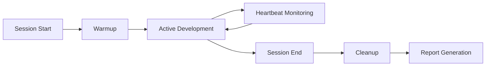

# DevAssist MCP Server v2.2.0 🚀

An intelligent development assistant that provides runtime session management, architectural memory, and AI-powered code intelligence through the Model Context Protocol (MCP).

## 🌟 Overview

DevAssist transforms your development workflow by maintaining context across sessions, tracking decisions, preventing duplicate work, and providing intelligent assistance throughout your coding journey.

### Key Benefits
- **40-60% Token Reduction**: Through advanced tool masking
- **Persistent Memory**: Never lose context between sessions
- **Intelligent Search**: Vector-based semantic code search
- **Automated Organization**: Smart file cleanup and organization
- **Session Intelligence**: Warmup, monitoring, and cleanup

## 🚀 Quick Start

### Installation

```bash
# Clone and install
git clone https://github.com/PerformanceSuite/DevAssist.git
cd DevAssist
npm install

# Initialize databases
npm run db:init

# Start the server
npm start
```

### Claude Desktop Configuration

Add to `~/Library/Application Support/Claude/claude_desktop_config.json`:

```json
{
  "mcpServers": {
    "devassist": {
      "command": "node",
      "args": ["/path/to/DevAssist/index.js"]
    }
  }
}
```

## 📦 Features

### 🎨 UI Module (NEW!)
Enhanced visual development environment with:

- **Live Preview**: Split-screen code + browser preview with Playwright
- **Visual Regression Testing**: Pixel-perfect comparison and diff generation
- **Design System Validation**: Enforce design tokens and spacing scales
- **Performance Tracking**: Real-time metrics and budget enforcement
- **Keyboard Shortcuts**: Cmd+R refresh, Cmd+S save, Cmd+V validate
- **Visual Checkpoints**: Git integration with automatic screenshots

#### UI Mode Commands
```bash
# Enter UI Focus Mode
/ui-mode --component Button --viewport mobile

# Create visual checkpoint
/ui-checkpoint "Updated button styles"

# Exit UI mode with summary
/ui-mode --exit
```

### Session Management
Complete lifecycle management for development sessions:

- **Session Start**: Warmup with context loading
- **Heartbeat Monitoring**: 5-minute interval checks
- **Terminal Logging**: Capture command history
- **Session End**: Intelligent cleanup and organization

### Architectural Memory
Record and retrieve development decisions:

```javascript
// Record a decision
devassist:record_architectural_decision {
  decision: "Use PostgreSQL for main database",
  context: "Need ACID compliance and complex queries",
  alternatives: ["MongoDB", "MySQL"],
  impact: "Requires schema migrations"
}

// Retrieve decisions
devassist:get_project_memory {
  query: "database decisions",
  category: "architecture"
}
```

### Semantic Search
Powerful vector-based code search:

- **Technology**: LanceDB + all-mpnet-base-v2 embeddings
- **Performance**: ~50ms for 1000+ records
- **Accuracy**: 768-dimensional embeddings for precision

### Progress Tracking
Monitor development milestones:

```javascript
devassist:track_progress {
  milestone: "Authentication system complete",
  status: "completed",
  notes: "JWT implementation with refresh tokens"
}
```

### Intelligent Cleanup
End-of-session file organization:

- Archives temporary files
- Detects and handles duplicates
- Organizes documentation
- Cleans build artifacts
- Updates .gitignore

## 🏗️ Architecture

### Directory Structure
```
DevAssist/
├── index.js                    # Main MCP server
├── src/
│   ├── database/              # Data layer
│   │   ├── dataAccess.js     # Unified data access
│   │   ├── init.js           # Database initialization
│   │   └── migrate.js        # Migration scripts
│   ├── commands/              # MCP command handlers
│   │   ├── initproject.js    # Project initialization
│   │   └── ...               # Other commands
│   ├── session/               # Session management
│   │   ├── warmup.js         # Session warmup
│   │   ├── terminal-logger.js # Terminal capture
│   │   └── cleanup-manager.js # Cleanup logic
│   └── documentation/         # Documentation tools
│       └── tech-docs-fetcher.js
├── data/                      # Persistent storage
│   ├── vectors/              # LanceDB vectors
│   └── *.json                # Legacy JSON storage
└── masks/                     # Tool masking configs
```

### Database Architecture

**Hybrid Approach**: SQLite + LanceDB

- **SQLite**: Structured data (projects, decisions, progress)
- **LanceDB**: Vector embeddings for semantic search
- **Migration**: Automatic migration from JSON to database

### Embedding Models

```javascript
// Available models
const EMBEDDING_MODELS = {
  'mpnet': {
    name: 'Xenova/all-mpnet-base-v2',
    dimensions: 768,
    description: 'Higher quality, better semantic understanding'
  },
  'minilm': {
    name: 'Xenova/all-MiniLM-L6-v2',
    dimensions: 384,
    description: 'Fast, lightweight, good for basic matching'
  }
};
```

## 🛠️ Available Tools

### Core Tools

| Tool | Description |
|------|-------------|
| `devassist:session-start` | Begin development session with warmup |
| `devassist:session-end` | End session with cleanup |
| `devassist:checkpoint` | Save session state |
| `devassist:track_progress` | Record milestones |
| `devassist:record_architectural_decision` | Document decisions |
| `devassist:get_project_memory` | Retrieve past context |
| `devassist:semantic_search` | Vector-based search |
| `devassist:identify_duplicate_effort` | Find similar code |

### Session Lifecycle



## 🧪 Testing

### Run Tests
```bash
npm test
```

### Test Coverage
- Database operations ✅
- Embedding generation ✅
- Semantic search ✅
- Session management ✅
- Cleanup operations ✅

### Performance Benchmarks
```bash
npm run benchmark
```

Results:
- Embedding generation: ~160ms (first run with model loading)
- Semantic search: ~50ms for 1000 records
- Database operations: < 10ms

## 📊 Session Intelligence

### Warmup Process
When starting a session, DevAssist:

1. Loads previous session context
2. Analyzes recent git changes
3. Checks terminal logs (last 50 commands)
4. Prepares search indices
5. Loads relevant documentation
6. Identifies pending TODOs
7. Starts heartbeat monitor
8. Activates terminal logger

### Cleanup Manager
Intelligent file organization at session end:

```javascript
// Cleanup rules
const CLEANUP_RULES = {
  archive: ['*.tmp', '*.log', '*.bak'],
  organize: {
    'docs/': ['*.md', '!README.md'],
    'tests/': ['*.test.js', '*.spec.js'],
    'archive/': ['old_*', 'backup_*']
  },
  ignore: ['.git', 'node_modules', '.devassist']
};
```

### Terminal Logger
Captures development context:

- Command history
- Error patterns
- Workflow analysis
- Productivity metrics

## 🔧 Configuration

### Environment Variables
Create `.env` file:

```env
# Database
DB_PATH=./data/db
VECTOR_DB_PATH=./data/vectors

# Embeddings
EMBEDDING_MODEL=mpnet

# Session
HEARTBEAT_INTERVAL=300000
TERMINAL_LOG_SIZE=1000

# Cleanup
ARCHIVE_RETENTION_DAYS=30
```

### Project Configuration
Each project gets a `.devassist/config.json`:

```json
{
  "project": "my-app",
  "type": "node",
  "features": ["docker", "testing", "ci"],
  "settings": {
    "sessionWarmup": true,
    "heartbeatInterval": 300000,
    "terminalLogging": true,
    "intelligentCleanup": true
  }
}
```

## 🔄 Migration

### From JSON to Database
```bash
# Automatic migration
npm run db:migrate

# Test migration without changes
npm run db:migrate test
```

## 🤝 Integration

### With Prjctzr
DevAssist integrates seamlessly with Prjctzr:

1. Prjctzr creates project structure
2. Sets up DevAssist configuration
3. DevAssist handles runtime operations

### With Claude Code
Custom slash commands available:
- `/start-session` - Begin with goals
- `/end-session` - End with cleanup
- `/track-progress` - Record achievements

## 📈 Roadmap

### Coming Soon
- [ ] Real-time collaboration features
- [ ] Advanced analytics dashboard
- [ ] Plugin system for extensions
- [ ] Cloud sync for team sharing
- [ ] AI-powered code review

### Future Enhancements
- Multi-model embedding support
- Distributed vector search
- Advanced cleanup strategies
- Session replay capabilities
- Team knowledge sharing

## 🐛 Troubleshooting

### Common Issues

**Database initialization fails**
```bash
# Reset databases
rm -rf data/vectors data/db.sqlite
npm run db:init
```

**Embedding model not loading**
```bash
# Clear model cache
rm -rf node_modules/@xenova
npm install
```

**Session not starting**
- Check `.devassist/` directory exists
- Verify project configuration
- Run with debug: `DEBUG=* npm start`

## 📄 License

MIT License - see LICENSE file

## 🔗 Links

- [GitHub Repository](https://github.com/PerformanceSuite/DevAssist)
- [MCP Documentation](https://modelcontextprotocol.io)
- [Report Issues](https://github.com/PerformanceSuite/DevAssist/issues)

## 👥 Contributors

Built with ❤️ by the Performance Suite team.

---

*DevAssist v2.2.0 - Intelligent Development Assistant with UI Module*
*Part of the Custom MCP Servers Suite*