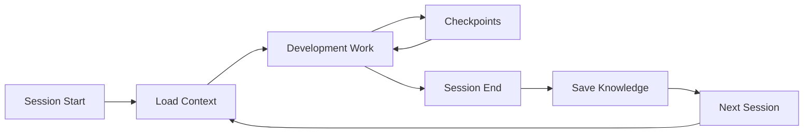

# DevAssist Session Management Guide

## Overview

Sessions provide continuity between Claude conversations, preserving context and knowledge across restarts. Each session tracks development activity, decisions, and progress.

## Session Lifecycle



## Starting a Session

### Using Slash Command
```bash
/session-start
```

This automatically:
- ✅ Verifies DevAssist is running
- ✅ Loads previous session context
- ✅ Starts terminal logging
- ✅ Initializes knowledge tracking

### Using Script
```bash
bash .devassist/scripts/session-manager.sh start
```

### What Happens on Start

1. **Context Loading**
   - Previous session summary
   - Recent terminal commands
   - Pending tasks
   - Last git status

2. **Knowledge Activation**
   - Vector database initialized
   - Documentation indexed
   - Previous decisions loaded

3. **Logging Setup**
   - Terminal recording begins
   - Session file created
   - Timestamp recorded

## During a Session

### Automatic Tracking

DevAssist automatically tracks:
- Architectural decisions made
- Progress on milestones
- Code patterns analyzed
- Documentation accessed
- Terminal commands executed

### Manual Checkpoints

Save progress at any time:

```bash
/session-checkpoint "Completed user auth feature"
```

Or via script:
```bash
bash .devassist/scripts/session-manager.sh checkpoint "Description"
```

### Checkpoint Contents

```json
{
  "timestamp": "2025-01-03T10:30:00Z",
  "summary": "Completed user auth feature",
  "git_status": "5 files changed",
  "decisions_made": 2,
  "knowledge_added": 3,
  "next_steps": ["Test OAuth flow", "Add error handling"]
}
```

## Ending a Session

### Using Slash Command
```bash
/session-end
```

### Using Script
```bash
bash .devassist/scripts/session-manager.sh end
```

### What Happens on End

1. **Knowledge Review**
   - Decisions recorded
   - Patterns indexed
   - Documentation updated

2. **Terminal Log Processing**
   - Commands extracted
   - Errors identified
   - Patterns recognized

3. **Context Preservation**
   - Session summary created
   - Knowledge saved to database
   - Bridge to next session prepared

## Session Files

### Active Session
**Location**: `.sessions/current.json`

```json
{
  "id": "20250103_103000",
  "project": "my-app",
  "started_at": "2025-01-03T10:30:00Z",
  "status": "active",
  "terminal_log": ".devassist/terminal_logs/session_20250103_103000.log",
  "git_branch": "feature/auth",
  "devassist": {
    "verified": true,
    "knowledge_items": 5,
    "decisions": 2
  }
}
```

### Completed Sessions
**Location**: `.sessions/session_[timestamp].json`

Contains full session history including:
- All checkpoints
- Knowledge added
- Decisions made
- Terminal activity
- Git operations

## Terminal Logging

### Automatic Recording

Use the project launcher:
```bash
.devassist/scripts/claude-project.sh
```

This automatically:
- Creates timestamped log file
- Records all terminal activity
- Preserves for knowledge extraction

### Manual Recording

```bash
script -q .devassist/terminal_logs/manual_$(date +%Y%m%d_%H%M%S).log
# Your commands here
exit  # Stop recording
```

### Log Structure

```
════════════════════════════════════════
SESSION START: 2025-01-03 10:30:00
Project: my-app
Directory: /Users/name/Projects/my-app
Git Branch: feature/auth
════════════════════════════════════════

$ npm install express
... output ...

$ git add .
... output ...

════════════════════════════════════════
SESSION END: 2025-01-03 11:45:00
Knowledge items reviewed and saved
════════════════════════════════════════
```

## Knowledge Persistence

### What's Preserved

Between sessions, DevAssist maintains:

1. **Architectural Decisions**
   - Why choices were made
   - Alternatives considered
   - Expected impact

2. **Code Understanding**
   - Pattern recognition
   - Duplicate detection
   - Semantic relationships

3. **Progress State**
   - Milestone status
   - Blockers identified
   - Completed tasks

4. **Terminal History**
   - Commands used
   - Errors encountered
   - Solutions found

### Accessing Previous Knowledge

```bash
# Get previous decisions
devassist:get_project_memory category="decisions"

# Search semantically
devassist:semantic_search query="how did we implement auth"

# Review progress
devassist:generate_summary days_back=7
```

## Session Continuity

### Bridge Between Sessions

When starting a new session after ending one:

```json
{
  "bridge": {
    "from_session": "20250103_103000",
    "to_session": "20250103_140000",
    "context_preserved": true,
    "knowledge_transferred": 15,
    "time_gap": "3 hours"
  }
}
```

### Context Recovery

If a session ends unexpectedly:

1. DevAssist detects incomplete session
2. Recovers terminal logs
3. Extracts available knowledge
4. Creates recovery checkpoint

## Best Practices

### 1. Always Start and End Sessions
```bash
/session-start
# ... work ...
/session-end
```

### 2. Create Regular Checkpoints
- After completing features
- Before major changes
- When switching context

### 3. Use Descriptive Summaries
```bash
# Good
/session-checkpoint "Implemented JWT auth with refresh tokens"

# Not helpful
/session-checkpoint "did stuff"
```

### 4. Review Session History
```bash
ls -la .sessions/
cat .sessions/session_20250103_103000.json
```

## Advanced Features

### Session Queries

Find specific sessions:
```bash
# Recent sessions
ls -t .sessions/session_*.json | head -5

# Sessions on specific branch
grep -l '"git_branch": "feature/auth"' .sessions/*.json

# Sessions with many decisions
grep -l '"decisions": [5-9]' .sessions/*.json
```

### Session Metrics

Track productivity:
```bash
# Count total sessions
ls -1 .sessions/session_*.json | wc -l

# Average session duration
# (would need script to calculate)

# Decisions per session
grep '"decisions":' .sessions/*.json | cut -d: -f3
```

### Session Export

Export session data:
```bash
# Export to markdown
cat .sessions/session_*.json | \
  jq -r '.summary' > session_summaries.md

# Export decisions
cat .sessions/session_*.json | \
  jq -r '.decisions[]' > all_decisions.md
```

## Troubleshooting

### Session Won't Start

1. Check DevAssist is running:
```bash
ps aux | grep devassist
```

2. Verify configuration:
```bash
cat .devassist/config/devassist.json
```

3. Check permissions:
```bash
ls -la .sessions/
```

### Lost Session Data

1. Check for backup:
```bash
ls .sessions/*.backup
```

2. Recover from terminal log:
```bash
cat .devassist/terminal_logs/session_*.log
```

3. Rebuild from git history:
```bash
git reflog
```

### Session Conflicts

If multiple sessions appear active:

1. Identify current:
```bash
cat .sessions/current.json
```

2. Archive conflicts:
```bash
mv .sessions/current.json .sessions/conflict_$(date +%s).json
```

3. Start fresh:
```bash
/session-start
```

---

*Sessions are the memory of your development journey - use them wisely*
